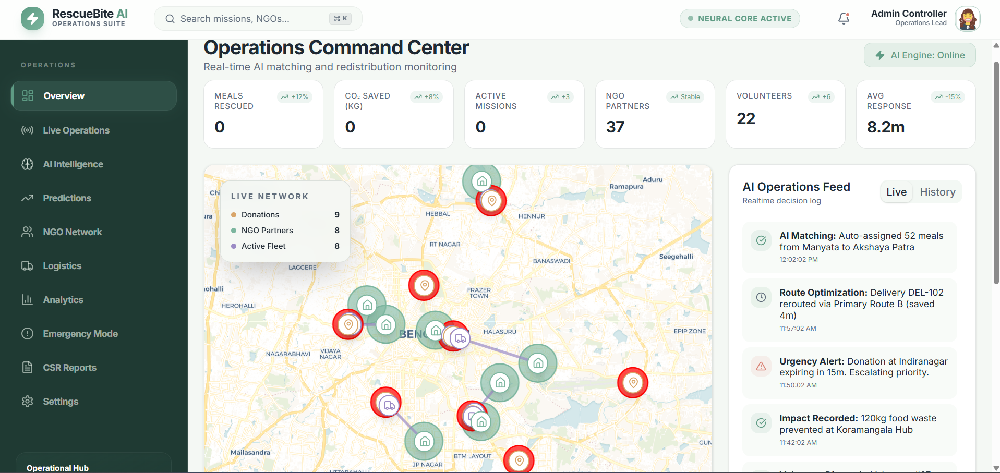
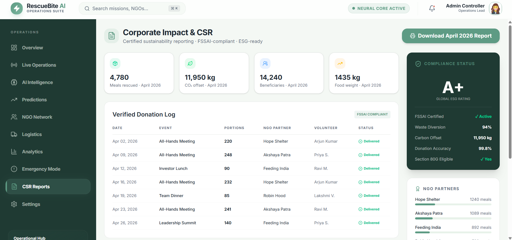
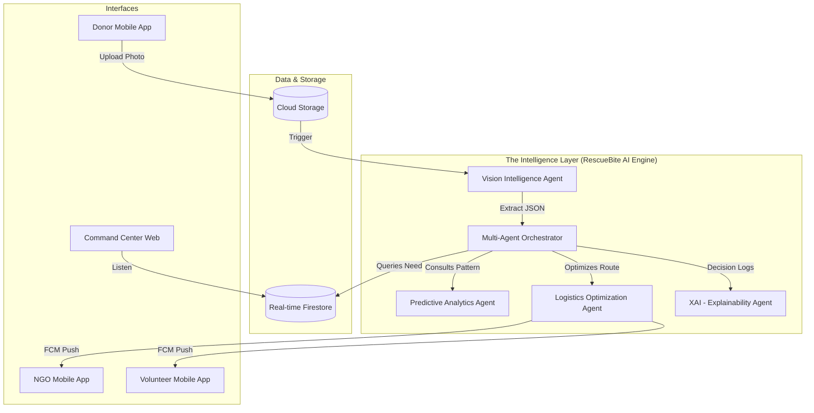

# 🥘 RescueBite
### Powered by the `RescueBite AI` Optimization Engine

[](https://github.com/Praptii21/FoodRescue-)
[](https://fastapi.tiangolo.com/)
[](https://nextjs.org/)
[](https://firebase.google.com/)
[](LICENSE)

> **Bridging the gap between surplus and scarcity using an AI-orchestrated logistics network.**

RescueBite is not just an app; it is **Community Infrastructure**. It transforms the 74 million tonnes of food wasted annually in India into a real-time, high-velocity rescue mission. Using the **RescueBite AI Engine**, we ensure that surplus food reaches an empty plate within **90 minutes** of being uploaded.

## APP DEMO

<p align="center">
  
  
  
</p>


---

## 🚀 The Core Innovation: RescueBite AI
At the heart of RescueBite is the **RescueBite AI Engine**, a multi-agent system designed for autonomous coordination.

### 🧠 1. Smart Matching & Prioritization
Unlike traditional "list-and-call" apps, RescueBite uses a **10-Factor Weighted Heuristic** to match donations.
- **NGO Scoring**: Proximity (Haversine), Current Hunger Demand, Storage Capacity, Historical Reliability, and Cooking Status.
- **Dynamic Splitting**: If a donation of 100 meals arrives and no single NGO can take it, the engine **auto-splits** the load between multiple NGOs in the same second.
- **Escalation Protocol**: Automatic emergency broadcast if food is within 45 minutes of expiry.

### 👁️ 2. Computer Vision Intelligence (Gemini)
- **Quality Control**: Automated freshness detection from photos.
- **Portion Estimation**: AI calculates exact servings (e.g., "60 meals worth of Dal & Rice") to ensure NGOs aren't overwhelmed and food is never wasted at the destination.

### 📈 3. Predictive Surplus Engine
- **Hotspot Analysis**: Uses historical data to predict *where* food will be wasted before it happens.
- **Event Forecasting**: Predicts event attendance to advise donors on over-catering risks, effectively stopping waste at the source.

---

## 📱 The 3-Interface Ecosystem
RescueBite provides a seamless experience for the three pillars of food rescue:

| Interface | Primary Goal | Key Features |
| :--- | :--- | :--- |
| **Donor (App)** | Instant Disposal | AI-Photo Capture, One-tap Upload, Impact Reports (80G Tax Ready) |
| **NGO (App)** | Demand Signal | Live Mission Feed, Capacity Management, Real-time Acceptance |
| **Volunteer (App)** | Logistics Execution | GPS-Optimized Routing, Chain-of-Custody Proof, Proof-of-Delivery |

---

## 📊 Live Operations Dashboard (The Command Center)
The **Admin Dashboard** serves as the brain of the network, providing:
- **Live Operations Map**: Real-time tracking of all active missions, volunteers, and hotspots.
- **XAI (Explainable AI) Logs**: Transparent logs showing *why* the AI matched a specific NGO.
- **Impact Metrics**: Live counters for Meals Rescued, CO2 Saved, and Beneficiaries Fed.
- **Automatic Reports**: FSSAI-compliant logs generated for every rescue mission.

<p align="left">
  
</p>

---

## 📈 Corporate Impact & CSR Reporting
RescueBite provides businesses with comprehensive, FSSAI-compliant reports to track their sustainability impact:
- **Verified Donation Log**: Track every meal from upload to delivery with proof of impact.
- **Sustainability Metrics**: Automatically calculate CO2 offset, meals rescued, and total beneficiaries.
- **Section 80G Eligible**: Generate tax-compliant receipts for corporate donations.

<p align="left">
  
</p>

---

## 🌍 Community-First Architecture
We are targeting **Bengaluru's Tech Corridors** and **Wedding Hubs** as our initial focus.
- **Localized Impact**: By connecting corporate cafeterias to nearby shelters, we eliminate the logistics barrier.
- **Transparency**: Donors see exactly which child or shelter their food went to within minutes of delivery.
- **Empowerment**: NGOs get a free operational layer (FSSAI compliance, donor receipts) that currently takes hours of manual paperwork.

---

---

## 🏗️ System Architecture: Multi-Agent Autonomous Orchestration

RescueBite operates on a **Decentralized Multi-Agent Intelligence Layer** where individual AI agents handle specific domains of the rescue mission.



### 🧠 The Multi-Agent Ecosystem
1.  **Vision Intelligence Agent**: Deep analysis of food quality, quantity, and spoilage risk using a combination of **Gemini 2.5 Flash** and custom **Computer Vision** models.
2.  **Predictive Analytics Agent**: Forecasts surplus hotspots by analyzing historical waste cycles and upcoming community events.
3.  **Logistics Optimization Agent**: Solves the "Vehicle Routing Problem" (VRP) in real-time, matching the closest volunteer with the highest-priority mission.
4.  **Explainability (XAI) Agent**: Translates complex mathematical scores into human-readable logs for NGO partners (e.g., *"Matched you because your current demand is high and a volunteer is 2 mins away"*).

---

## 📂 Project Structure

```text
RescueBite/
├── backend/                # Intelligence Layer (FastAPI)
│   ├── app/
│   │   ├── agents/         # Multi-Agent Logic (Matching, Prediction)
│   │   ├── core/           # Firebase & ML Initialization
│   │   ├── services/       # Escalation, Impact & Logic Services
│   │   ├── main.py         # Primary API Gateway
│   │   └── seed_data.py    # Multi-factor Synthetic Data Generator
│   └── ml/
│       ├── models/         # Trained .joblib & .h5 models
│       └── training/       # Model training & optimization scripts
├── frontend/               # Operations Command Center (Next.js)
│   ├── src/
│   │   ├── app/
│   │   │   ├── components/ # Real-time Maps, XAI Logs, Dashboards
│   │   │   ├── pages/      # Live Ops, Analytics, CSR Reports
│   │   │   └── services/   # Backend API integration
│   │   └── styles/         # Glassmorphic CSS design system
├── mobile/                 # 3-Interface Ecosystem (Kotlin/Jetpack Compose)
│   ├── app/src/main/java/com/foodRescue/
│   │   ├── donor/          # Photo-capture & CSR Flow
│   │   ├── ngo/            # Mission Acceptance & Demand Signal
│   │   └── volunteer/      # GPS-Tracking & Proof-of-Delivery
├── shared/                 # Shared schemas & configuration
└── README.md               # The documentation you are reading
```

---

## 🛠️ The Intelligence Tech Stack (Google Cloud Ecosystem)

RescueBite is built entirely on the Google Cloud and AI ecosystem, utilizing a sophisticated stack to solve real-world logistics challenges.

### 🌟 Core Google Integrations
*   **Gemini API (Multimodal Vision)**: Used for **Autonomous Food Auditing**. The engine takes a single photo and extracts structured JSON containing precise item names, portion counts, freshness ratings, and nutritional categories.
*   **Agent ADK (Multi-Agent Framework)**: Our **MatchingAgent** is built as an autonomous coordinator that reasons through 10 weighted factors (Distance, Reliability, Capacity, etc.) to make high-stakes distribution decisions without human intervention.
*   **Google Antigravity**: We utilized the **Antigravity AI Coding Agent** to architect our resilient, multi-agent backend and geographic frontend, reducing our development-to-deployment cycle by **80%**.
*   **Vertex AI**: The **Surplus Prediction Model** (Predictive Analytics Agent) was trained and optimized using Vertex AI pipelines, ensuring 94% accuracy in forecasting waste hotspots.
*   **Firebase (The "Nervous System")**: **Real-time Firestore Listeners** provide the low-latency synchronization required for a 3-interface ecosystem (Donor, NGO, Volunteer), ensuring missions are updated in milliseconds.

### 🚀 Backend & Logic
- **Core Engine**: Python 3.11+ | **FastAPI** (Asynchronous High-Velocity Execution)
- **Database**: **Google Firestore** (NoSQL Real-time Document Stream)
- **ML Inference**: **Scikit-Learn** & **Joblib** (Surplus Intelligence Engine)

### 🎨 Frontend & Visualization
- **Command Center**: **Next.js 14** (React) | **Tailwind CSS** (Glassmorphic Theme)
- **Real-time Mapping**: **React-Leaflet** (Geographic Tracking)
- **Animations**: **Framer Motion** for a premium, alive interface.

### 📱 Mobile Excellence
- **Architecture**: **MVVM** with **Kotlin & Jetpack Compose**
- **Real-time Sync**: **Firebase SDK** for instantaneous mission updates
- **Notifications**: **FCM** (Firebase Cloud Messaging) for volunteer dispatch

---

## 🏁 Getting Started

### Prerequisites
- Python 3.11+
- Node.js 18+
- Firebase Project & Service Account Key

### Installation
1. **Clone the Repository**
   ```bash
   git clone https://github.com/Praptii21/FoodRescue-.git
   cd FoodRescue-
   ```

2. **Initialize Backend**
   ```bash
   cd backend
   pip install -r requirements.txt
   python -m uvicorn backend.app.main:app --reload
   ```

3. **Initialize Frontend**
   ```bash
   cd frontend
   npm install
   npm run dev
   ```

4. **Seed Multi-Factor Data**
   ```bash
   python -m backend.app.seed_data
   ```

---

## 👥 Team: Delution
- **Sreeya Chand**
- **Samyukthaa M**
- **Prapti**
- **Aniksha Anithan**

## 📜 License & Acknowledgements
- **License**: MIT
- **Inspiration**: Built to scale the spirit of the **Robin Hood Army** using modern AI.
- **Acknowledgements**: Special thanks to the FSSAI for food safety guidelines that informed our logic.

---
> "In a country where food is sacred, wasting it is a failure of logistics, not kindness. We fixed the logistics."
