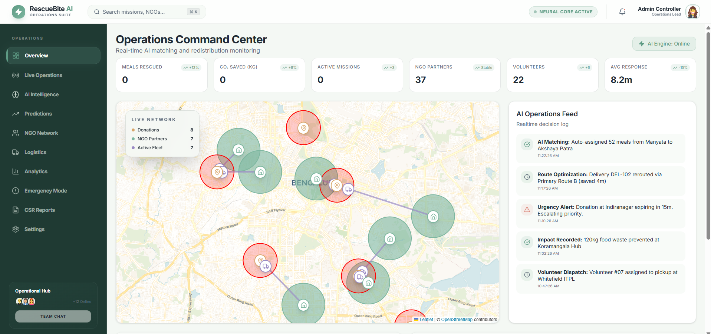

# 🥘 AnnaSetu
### Powered by the `RescueBite AI` Optimization Engine

[](https://github.com/Praptii21/FoodRescue-)
[](https://fastapi.tiangolo.com/)
[](https://nextjs.org/)
[](https://firebase.google.com/)
[](LICENSE)

> **Bridging the gap between surplus and scarcity using an AI-orchestrated logistics network.**

AnnaSetu is not just an app; it is **Community Infrastructure**. It transforms the 74 million tonnes of food wasted annually in India into a real-time, high-velocity rescue mission. Using the **RescueBite AI Engine**, we ensure that surplus food reaches an empty plate within **90 minutes** of being uploaded.

---

## 🚀 The Core Innovation: RescueBite AI
At the heart of AnnaSetu is the **RescueBite AI Engine**, a multi-agent system designed for autonomous coordination.

### 🧠 1. Smart Matching & Prioritization
Unlike traditional "list-and-call" apps, RescueBite uses a **10-Factor Weighted Heuristic** to match donations.
- **NGO Scoring**: Proximity (Haversine), Current Hunger Demand, Storage Capacity, Historical Reliability, and Cooking Status.
- **Dynamic Splitting**: If a donation of 100 meals arrives and no single NGO can take it, the engine **auto-splits** the load between multiple NGOs in the same second.
- **Escalation Protocol**: Automatic emergency broadcast if food is within 45 minutes of expiry.

### 👁️ 2. Computer Vision Intelligence (YOLOv8 & Gemini)
- **Quality Control**: Automated freshness detection from photos.
- **Portion Estimation**: AI calculates exact servings (e.g., "60 meals worth of Dal & Rice") to ensure NGOs aren't overwhelmed and food is never wasted at the destination.

### 📈 3. Predictive Surplus Engine
- **Hotspot Analysis**: Uses historical data to predict *where* food will be wasted before it happens.
- **Event Forecasting**: Predicts event attendance to advise donors on over-catering risks, effectively stopping waste at the source.

---

## 📱 The 3-Interface Ecosystem
AnnaSetu provides a seamless experience for the three pillars of food rescue:

| Interface | Primary Goal | Key Features |
| :--- | :--- | :--- |
| **Donor (App)** | Instant Disposal | AI-Photo Capture, One-tap Upload, Impact Reports (80G Tax Ready) |
| **NGO (App)** | Demand Signal | Live Mission Feed, Capacity Management, Real-time Acceptance |
| **Volunteer (App)** | Logistics Execution | GPS-Optimized Routing, Chain-of-Custody Proof, Proof-of-Delivery |

---

## 📊 Live Operations Dashboard (The Command Center)
The **Admin Dashboard** serves as the brain of the network, providing:
- **Live Operations Map**: Real-time tracking of all active missions, volunteers, and hotspots.
- **XAI (Explainable AI) Logs**: Transparent logs showing *why* the AI matched a specific NGO.
- **Impact Metrics**: Live counters for Meals Rescued, CO2 Saved, and Beneficiaries Fed.

<p align="left">
  
</p>
- **Automatic Reports**: FSSAI-compliant logs generated for every rescue mission.

---

## 🌍 Community-First Architecture
We are targeting **Bengaluru's Tech Corridors** and **Wedding Hubs** as our initial focus.
- **Localized Impact**: By connecting corporate cafeterias to nearby shelters, we eliminate the logistics barrier.
- **Transparency**: Donors see exactly which child or shelter their food went to within minutes of delivery.
- **Empowerment**: NGOs get a free operational layer (FSSAI compliance, donor receipts) that currently takes hours of manual paperwork.

---

## 🛠️ Technical Stack

### Backend Infrastructure
- **Core**: Python 3.11 with **FastAPI** for high-performance asynchronous execution.
- **Database**: **Google Firestore** for real-time document synchronization.
- **Authentication**: **Firebase Auth** (Phone, Google, Email).

### AI & Machine Learning
- **Vision**: **Gemini 2.5 Flash** for deep food analysis and **YOLOv8** for real-time item detection.
- **Inference**: **Scikit-Learn & Joblib** for the predictive surplus engine.

### Frontend & Visuals
- **Web**: **Next.js 14** with **Tailwind CSS** for the Command Center.
- **Mapping**: **React-Leaflet** for real-time geographic tracking across the city.
- **Animations**: **Framer Motion** for a premium, alive interface.

---

## 🏁 Getting Started

### Prerequisites
- Python 3.11+
- Node.js 18+
- Firebase Project & Service Account Key

### Installation
1. **Clone the Repository**
   ```bash
   git clone https://github.com/Praptii21/FoodRescue-.git
   cd FoodRescue-
   ```

2. **Initialize Backend**
   ```bash
   cd backend
   pip install -r requirements.txt
   python -m uvicorn backend.app.main:app --reload
   ```

3. **Initialize Frontend**
   ```bash
   cd frontend
   npm install
   npm run dev
   ```

4. **Seed Multi-Factor Data**
   ```bash
   python -m backend.app.seed_data
   ```

---

## 👥 Team: Delution
- **Sreeya Chand**
- **Samyukthaa M**
- **Prapti**
- **Aniksha Anithan**

## 📜 License & Acknowledgements
- **License**: MIT
- **Inspiration**: Built to scale the spirit of the **Robin Hood Army** using modern AI.
- **Acknowledgements**: Special thanks to the FSSAI for food safety guidelines that informed our logic.

---
> "In a country where food is sacred, wasting it is a failure of logistics, not kindness. We fixed the logistics."
